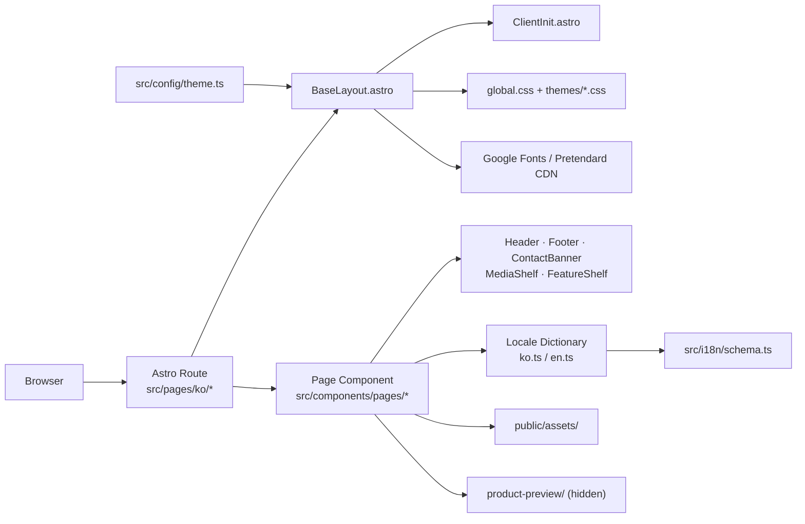
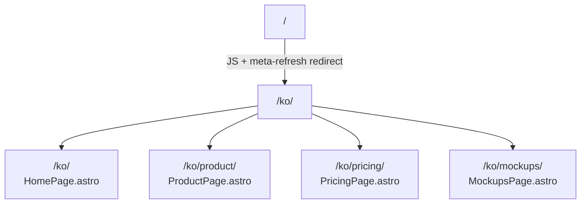

# SelecAI Marketing Site

Static Astro site for **SelecAI**, a multi-AI platform by **로그케이 (LogK)** that lets teams choose, delegate across, compare, and verify answers from multiple AI models.

Live site: **https://www.logk.co.kr**

---

## What This Project Is

- An Astro 6 static site deployed to GitHub Pages
- A Korean-only marketing site (`ko` is the only active locale; `/` redirects to `/ko/`)
- A light-mode-only design with a swappable CSS theme system
- Four content pages: Home, Product, Pricing, Mockups
- A product-preview React/Vite embed (built but currently hidden in the hero)

---

## Core Principles

1. **Routes stay thin.** Route files load a dictionary and render one page component. No markup logic in `src/pages/`.
2. **Marketing copy lives in dictionaries.** All visible strings go in `src/i18n/messages/ko.ts`.
3. **Page sections live in page components.** Large composition belongs in `src/components/pages/`.
4. **Shared chrome stays shared.** Header, Footer, LanguageSwitcher, ClientInit are in `src/components/`.
5. **Static assets are explicit.** Images and videos live in `public/assets/`.
6. **One theme at a time.** Set `THEME` in `src/config/theme.ts` to switch the entire visual style.

---

## Tech Stack

| Layer | Choice | Notes |
|-------|--------|-------|
| Framework | Astro 6, static output | GitHub Pages-ready, no SSR |
| Styling | Global CSS + per-theme CSS files | Light mode only; dark mode vars exist but are unused |
| Fonts | IBM Plex Mono, Instrument Sans, Sora (Google Fonts); Pretendard (CDN, blue theme only) | Loaded in BaseLayout |
| i18n | Astro i18n + typed dictionaries | Korean only; `prefixDefaultLocale: true` |
| Interactivity | Inline `<script>` in components + `ClientInit.astro` | No framework on the Astro side |
| Product preview | React + Vite, built to `public/product-preview/` | Mounted via `[data-product-preview]`; currently hidden |

---

## Quick Start

```bash
npm install
npm run dev          # http://localhost:4321
npm run build        # production build → dist/
npm run preview      # serve dist/ locally
npm run check        # tsc + astro check
```

---

## Environment Variables

All configuration lives in `astro.config.mjs`.

| Variable | Purpose | Default |
|----------|---------|---------|
| `SITE_URL` | Canonical origin (no trailing path) | `https://www.logk.co.kr` |
| `BASE_PATH` | Subpath for GitHub project Pages | `undefined` (root) |

`normalizeBase()` in `astro.config.mjs` converts `"/"` or empty string to `undefined` so Astro uses no base path.

```bash
# Local build matching the company repo
SITE_URL=https://www.logk.co.kr BASE_PATH=/ npm run build

# Local build matching a GitHub project Pages repo
SITE_URL=https://username.github.io BASE_PATH=/PAGE_DEMO npm run build
```

---

## Project Map

```text
.
├── astro.config.mjs              # site/base config, i18n, locale list
├── package.json
├── .github/workflows/deploy.yml  # GitHub Pages CI
├── docs/                         # supplementary guides
├── product-preview/              # React/Vite embedded preview (separate package)
│   ├── package.json
│   ├── vite.config.ts            # library build → public/product-preview/
│   └── src/
│       ├── App.tsx
│       ├── main.tsx              # mounts into [data-product-preview]
│       ├── i18n.ts
│       ├── preview.css           # namespaced under .lpv-* prefix
│       └── components/
├── public/
│   ├── assets/
│   │   ├── selecAI_mockup/       # product screenshot assets (images + videos)
│   │   │   ├── selecAI_multi_delegate.mov
│   │   │   ├── selecAI_image_gen.mov
│   │   │   ├── selecAI_private_masking.png
│   │   │   ├── selecAI_corp_mgnt.png
│   │   │   ├── selecAI_user_mgmt.png
│   │   │   └── selecAI_prompt_pay.png
│   │   ├── workspace_screenshot.png
│   │   ├── pricing_screenshot.png
│   │   ├── tech-lattice.svg
│   │   ├── hero-orbit.svg
│   │   └── signal-grid.svg
│   ├── og-home.png               # OG image for homepage (1200×630 px)
│   ├── og-product.png
│   ├── og-pricing.png
│   ├── og-mockups.png
│   ├── og.png                    # fallback OG image
│   └── product-preview/          # generated by npm run build:preview (git-ignored)
├── src/
│   ├── config/
│   │   └── theme.ts              # THEME constant: "blue" | "logk"
│   ├── shared/
│   │   └── tabs.ts               # PREVIEW_TAB_IDS and PreviewTabId type
│   ├── i18n/
│   │   ├── locales.ts            # single source of truth for active locales
│   │   ├── schema.ts             # SiteDictionary type + re-exports
│   │   └── messages/
│   │       ├── index.ts          # getDictionary(locale) resolver
│   │       ├── ko.ts             # Korean content
│   │       └── en.ts             # English content (currently unused by routes)
│   ├── utils/
│   │   └── i18n.ts               # localizedPath(), getLanguageOptions(), isLocale()
│   ├── layouts/
│   │   └── BaseLayout.astro      # HTML shell, meta, OG, fonts, ClientInit
│   ├── components/
│   │   ├── ClientInit.astro      # global JS: header, reveal, mobile menu
│   │   ├── Header.astro
│   │   ├── Footer.astro
│   │   ├── LanguageSwitcher.astro
│   │   ├── ThemeToggle.astro     # currently not shown in header
│   │   ├── ContactBanner.astro   # dark gradient CTA strip
│   │   ├── MediaShelf.astro      # segmented tab bar + horizontal scroll shelf
│   │   ├── FeatureShelf.astro    # dot-navigated horizontal feature shelf
│   │   └── pages/
│   │       ├── HomePage.astro
│   │       ├── ProductPage.astro
│   │       ├── PricingPage.astro
│   │       └── MockupsPage.astro
│   ├── pages/
│   │   ├── index.astro           # root redirect → /ko/
│   │   ├── ko/
│   │   │   ├── index.astro       # home
│   │   │   ├── product.astro
│   │   │   ├── pricing.astro
│   │   │   └── mockups/index.astro
│   │   └── en/
│   │       └── pricing.astro     # stub; no other EN routes active
│   ├── styles/
│   │   ├── global.css
│   │   └── themes/
│   │       ├── blue.css          # clean blue professional (SelecAI reference)
│   │       └── logk.css          # warm teal editorial (original LogK brand)
│   └── content.config.ts         # empty; no content collections in use
└── README.md
```

---

## Architecture Overview



---

## Route Structure

Only Korean routes are active. `/` immediately redirects to `/ko/`.



`src/pages/en/pricing.astro` exists but there are no other EN routes. To fully activate English, add `"en"` to `src/i18n/locales.ts` and create the missing route files.

### Route file pattern

Every route file follows this exact pattern — keep it thin:

```astro
---
import PageComponent from "@/components/pages/PageComponent.astro";
import BaseLayout from "@/layouts/BaseLayout.astro";
import { getDictionary } from "@/i18n/messages";

const locale = "ko";
const dictionary = getDictionary(locale);
---

<BaseLayout
  locale={locale}
  title={dictionary.meta.pageTitle}
  description={dictionary.meta.pageDescription}
  ogImageFile="og-page.png"
>
  <PageComponent locale={locale} dictionary={dictionary} />
</BaseLayout>
```

The homepage also injects the product-preview stylesheet via a head slot:

```astro
<BaseLayout ...>
  <link slot="head" rel="stylesheet" href={productPreviewCss} />
  <HomePage locale={locale} dictionary={dictionary} />
</BaseLayout>
```

---

## Theme System

The active theme is set in **`src/config/theme.ts`**:

```ts
export const THEME = "blue" as const;  // or "logk"
export type Theme = "logk" | "blue";
```

`BaseLayout.astro` reads `THEME` and adds `class="theme-{THEME}"` to `<html>`. The matching CSS file under `src/styles/themes/` defines all design tokens. Dark mode HTML is present in the theme CSS files but is deliberately disabled — `BaseLayout` hardcodes `data-theme="light"` and `<meta name="color-scheme" content="light">`.

### Theme: `blue` (current)

File: `src/styles/themes/blue.css`

| Token | Value |
|-------|-------|
| `--bg` | `#F8FAFF` |
| `--text` | `#111827` |
| `--accent` | `#2563EB` |
| `--surface` | `#FFFFFF` |
| `--surface-border` | `#E5E7EB` |
| `--contact-gradient` | `linear-gradient(135deg, #2563EB, #7C3AED)` |
| `--radius-xl` | `24px` |
| Body font | Pretendard Variable (loaded from CDN) |

### Theme: `logk`

File: `src/styles/themes/logk.css` — warm teal / editorial style (original LogK brand). Swap `THEME` to `"logk"` to activate.

---

## i18n

### Locale registration

`src/i18n/locales.ts` is the single source of truth:

```ts
export const locales = ["ko"] as const;
export type Locale = (typeof locales)[number];
```

This file is imported by `astro.config.mjs`, `schema.ts`, and `utils/i18n.ts`. Add a new locale string here first, then follow the steps in **Add a New Language** below.

### Dictionary resolver

`src/i18n/messages/index.ts` exports `getDictionary(locale: Locale): SiteDictionary`. Route files call this to get all copy for a page.

### Utility helpers (`src/utils/i18n.ts`)

```ts
localizedPath(locale, pathname?)  // → "/ko/pricing/" (respects BASE_URL)
getLanguageOptions(locale, pathname?)  // → [{label, href, active}]
isLocale(value)  // type guard
```

---

## SiteDictionary Schema

Defined in `src/i18n/schema.ts`. Every locale file must satisfy this type.

```ts
type SiteDictionary = {
  meta: {
    siteName: string;         // shown in header brand wordmark
    homeTitle: string;        // <title> for home page
    homeDescription: string;
    productTitle: string;
    productDescription: string;
    pricingTitle: string;
    pricingDescription: string;
    mockupsTitle: string;
    mockupsDescription: string;
  };

  nav: {
    items: NavItem[];         // rendered as header nav links
    product: string;
    pricing: string;
    talkToSales: string;
    home: string;
    bookDemo: string;         // header CTA button label
    menuOpen: string;         // aria-label for hamburger open
    menuClose: string;        // aria-label for hamburger close
  };

  hero: {
    eyebrow: string;
    title: string;            // supports \n + white-space: pre-line
    titleAccent: string;      // rendered in .headline-shift color
    lede: string;
    primaryCta: string;
    secondaryCta: string;
    metrics: Array<{ value: string; label: string }>;
    previewFeatures: Array<{
      id: PreviewFeatureId;   // must match a PREVIEW_TAB_IDS value
      label: string;
      summary: string;
    }>;
    previewFallback: { title: string; body: string };
  };

  trust: string[];            // short feature tags (not rendered on homepage currently)

  company: {
    eyebrow: string;
    body: string[];           // each entry renders as a <p> in the company section
  };

  // solution, showcase, technology, contact — defined in schema, populated in ko.ts
  // but not rendered on the current homepage. Kept for future use.

  productPage: {
    eyebrow: string;
    title: string;            // supports \n + white-space: pre-line
    description: string;
    stages: Array<{ label: string; title: string; body: string }>;
    surfaces: Array<{ index: string; title: string; body: string; wide?: boolean }>;
    flowEyebrow: string;
    flowTitle: string;
    flowDescription: string;
    steps: Array<{ number: string; title: string; body: string }>;
    nextEyebrow: string;
    nextTitle: string;
    nextBody: string;
    primaryCta: string;
    secondaryCta: string;
    gallery: {
      workspaceLabel: string; workspaceTitle: string; workspaceBody: string; workspaceAlt: string;
      pricingLabel: string;   pricingTitle: string;  pricingBody: string;  pricingAlt: string;
    };
  };

  features: {
    eyebrow: string;
    title: string;
    description: string;      // rendered as .section-lede in media shelf intro
    rows: Array<{ eyebrow: string; title: string; body: string; bullets?: string[] }>;
    adminSection: { ... };    // not rendered on current homepage
  };

  pricingPage: {
    eyebrow: string;
    badge: string;
    title: string;
    titleEmphasis?: string;   // wrapped in <em class="pricing-h1-em">
    description: string;
    toggle: { monthly: string; yearly: string; discount: string; annualNote: string };
    creditLabel: string;
    plans: Array<{
      key: string; name: string; tagline: string;
      currency: string; monthlyPrice: string; yearlyPrice: string;
      credits: string; bonusCredits?: string; badge?: string;
      ctaLabel: string; ctaHref: string; highlight?: boolean;
      features: Array<{ text: string; sub?: string; icon?: "shield" }>;
    }>;
    enterprise: { title: string; description: string; tags: string[]; ctaLabel: string; ctaHref: string; note: string };
    creditNotes: string[];
    faq: { title: string; items: Array<{ question: string; answer: string }> };
    trialBanner: { title: string; body: string; ctaLabel: string; ctaHref: string };
  };

  mockupsPage: {
    eyebrow: string; title: string; description: string; lede: string; note: string;
    primaryCta: string; secondaryCta: string;
    scenes: Array<{ eyebrow: string; title: string; body: string }>;
  };
};
```

`NavItem` shape:

```ts
type NavItem = {
  key: "company" | "solution" | "technology" | "contact" | "pricing";
  label: string;
  href: string;  // "#hash", "pricing", or "mailto:..."
};
```

`href` values in `NavItem` are resolved by `Header.astro`:
- `#hash` → `{homePath}#hash` (always points to homepage)
- bare word like `"pricing"` → `localizedPath(locale, "pricing")`
- `mailto:` or `http(s):` → passed through unchanged

---

## Component Catalog

### `BaseLayout.astro`

HTML shell. Props:

```ts
interface Props {
  locale: Locale;
  title: string;
  description: string;
  ogImageFile?: string;  // filename in /public, default "og.png"
}
```

Responsibilities:
- Sets `<html lang={locale} class="theme-{THEME}" data-theme="light">`
- Loads Google Fonts (IBM Plex Mono, Instrument Sans, Sora) unconditionally
- Loads Pretendard from CDN when `THEME === "blue"`
- Emits full OG + Twitter Card meta tags
- Generates canonical URL from `Astro.site` (skipped when hostname is `example.com`)
- OG image is an absolute URL: `new URL(ogImageFile, Astro.site).href`
- Renders `<ClientInit />` at end of body
- Exposes `<slot name="head" />` for page-specific head injections

---

### `Header.astro`

Props:

```ts
interface Props {
  locale: Locale;
  dictionary: SiteDictionary;
  languageOptions: Array<{ label: string; href: string; active: boolean }>;
}
```

Structure: brand mark → hamburger toggle → `<nav>` with `dictionary.nav.items` → `.header-actions` (CTA button hardcoded to `mailto:adm@logk.co.kr`) → `.header-controls` (LanguageSwitcher).

The CTA button label comes from `dictionary.nav.bookDemo`.

Active nav state: `isActive()` compares `localizedPath(locale, item.href)` against `Astro.url.pathname`.

---

### `Footer.astro`

No props. Renders a single dark strip:

```html
<footer class="site-footer">
  <p>
    © {year} SelecAI (주)로그케이 ·
    <a href="#">이용약관</a> ·
    <a href="#">개인정보처리방침</a> ·
    문의: <a href="mailto:adm@logk.co.kr">adm@logk.co.kr</a>
  </p>
</footer>
```

CSS: `background: #111827`, centered text, `font-size: 0.8125rem`, link color `#60a5fa`.

---

### `ContactBanner.astro`

Reusable dark-gradient CTA section used at the bottom of Home, Product, and Pricing pages.

Props:

```ts
interface Props {
  eyebrow?: string;
  title: string;
  body: string;
  primaryLabel: string;
  primaryHref: string;
  secondaryLabel?: string;
  secondaryHref?: string;
}
```

Renders as `.trial-banner` with gradient background (`--contact-gradient`), centered content, and one or two action buttons. The secondary button uses `.trial-cta-secondary` (translucent white).

---

### `MediaShelf.astro`

Horizontal scroll shelf with a segmented tab bar synced to the active slide.

Props:

```ts
interface Props {
  segments: Array<{
    label: string;
    src: string;
    type: "image" | "video";
  }>;
}
```

Structure:
- `.media-tabs-wrap` → `.media-tabs` (segmented pill bar, centered, horizontally scrollable)
- `.media-shelf-track` → `.media-shelf-slide` items (CSS scroll-snap, center-aligned, 86% width with 7% inline padding creating peek on both sides)

Each slide renders `<video autoplay muted loop playsinline>` or ``.

Behavior (inline `<script>`):
- Clicking a tab calls `scrollIntoView({ inline: "center" })` on the target slide
- `IntersectionObserver` (threshold 0.6) syncs the active tab when the user swipes

Current segments (in order):

| Tab label | Asset file | Type |
|-----------|-----------|------|
| 멀티 위임 | `selecAI_multi_delegate.mov` | video |
| 이미지 생성 | `selecAI_image_gen.mov` | video |
| 개인정보 보호 | `selecAI_private_masking.png` | image |
| 기업 관리 | `selecAI_corp_mgnt.png` | image |
| 유저 관리 | `selecAI_user_mgmt.png` | image |
| 결재 워크플로 | `selecAI_prompt_pay.png` | image |

---

### `FeatureShelf.astro`

Horizontal scroll shelf with dot-nav, used for feature rows with copy + visual pairs.

Props:

```ts
interface Props {
  rows: SiteDictionary["features"]["rows"];  // eyebrow, title, body, bullets?
  assets: Array<{ src: string; type: "image" | "video" }>;
}
```

Each slide has `.feature-shelf-copy` (text) and `.feature-shelf-visual` (media) side by side. Dot buttons at the bottom scroll to the matching slide. `IntersectionObserver` syncs dots on swipe.

---

### `LanguageSwitcher.astro`

Props: `label: string`, `options: Array<{ label: string; href: string; active: boolean }>`.

Renders a dropdown-style switcher. Currently only "KO" is active since `locales = ["ko"]`.

---

### `ClientInit.astro`

Inlined in `BaseLayout`. Runs on every page. Responsibilities:

- Sticky header: adds `.is-scrolled` to `[data-header]` when `scrollY > 10`
- Mobile menu: `[data-nav-toggle]` toggles `[data-nav]` open/close, swaps `aria-label` between `menuOpen`/`menuClose` strings stored in `data-menu-*-label` attributes
- Reveal on scroll: `IntersectionObserver` adds `.is-visible` to `[data-reveal]` elements

---

## Page Composition

### HomePage.astro

Sections in order:

1. **Hero** — eyebrow, h1 (`title` + `titleAccent`), lede, two CTA buttons, hero video (`selecAI_multi_delegate.mov`). Product preview area exists but is `display:none`.
2. **#service** — centered h2 from `dictionary.productPage.title` (supports `\n` line breaks)
3. **Media shelf** — two `.section-lede` paragraphs (`productPage.description` + `features.description`), then `<MediaShelf segments={mediaSegments} />`
4. **#company** — 2-col grid: eyebrow left, body paragraphs right (`dictionary.company.body`)
5. **CTA** — `<ContactBanner>` using `productPage.next*` strings

Key variables:

```ts
const mockupBase = `${base}assets/selecAI_mockup/`;
const productPreviewBase = `${base}product-preview/`;
const pricingPath = localizedPath(locale, "pricing");
```

---

### ProductPage.astro

Sections: hero (eyebrow + h1 + description), product stage columns, screenshot gallery (2 articles with `workspace_screenshot.png` and `pricing_screenshot.png`), feature grid (`productPage.surfaces`), timeline steps, ContactBanner.

---

### PricingPage.astro

Sections: hero with billing toggle (monthly/yearly), plan cards, enterprise card, credit notes, FAQ accordion, ContactBanner (`trialBanner`).

Billing toggle: `[data-pricing-toggle]` buttons with `data-mode="monthly"|"yearly"`. JS in the component toggles prices and hides/shows elements with `[data-monthly]` / `[data-yearly]` attributes.

---

### MockupsPage.astro

Renders `src/components/mockups/` components: `ModelSelectionMockup`, `AnswerCompareMockup`, `PolicyControlMockup`, `CreditWalletMockup`, each wrapped in `MockupWindow`.

---

## CSS Architecture

All site styles are in `src/styles/global.css`. Design tokens are provided by the active theme file loaded at build time by `BaseLayout`.

Key token names (defined in theme CSS under `html.theme-blue`):

```
--bg, --bg-strong, --bg-top, --bg-bottom
--surface, --surface-strong, --surface-border
--text, --text-soft, --text-faint, --text-muted, --headline-shift
--accent, --accent-bright, --accent-soft, --accent-deep
--header-bg, --header-border, --header-shadow
--button-bg, --button-shadow, --button-text
--button-ghost-bg, --button-ghost-border, --button-ghost-text
--contact-gradient
--shadow-lg, --shadow-md
--radius-xl (24px), --radius-lg (20px), --radius-md (12px)
--body-font
--glow-blue, --glow-green, --glow-cyan
```

Key CSS classes:

| Class | Where used | Purpose |
|-------|-----------|---------|
| `.section` | page sections | max-width + padding wrapper |
| `.section-head` | section intros | `display: grid; gap: 1rem; max-width: 50rem` |
| `.section-head.narrow` | narrower intros | `max-width: 42rem` |
| `.section-lede` | intro paragraphs | `font-size: 1.2rem`, `color: var(--text-soft)`, `max-width: 60ch` |
| `.eyebrow` | section labels | small caps / mono style label above headings |
| `.button` | primary CTA | gradient background, uses `--button-*` tokens |
| `.button-ghost` | secondary CTA | white bg, border, `--button-ghost-*` tokens |
| `.media-shelf` | MediaShelf root | — |
| `.media-tabs-wrap` | tab bar container | centered, horizontally scrollable |
| `.media-tabs` | segmented pill bar | inline-flex, border, `border-radius: 999px` |
| `.media-tab.is-active` | selected tab | `background: var(--accent); color: #fff` |
| `.media-shelf-track` | scroll container | flex, `scroll-snap-type: x mandatory`, `padding-inline: 7%` |
| `.media-shelf-slide` | each item | `flex: 0 0 86%`, `scroll-snap-align: center` |
| `.trial-banner` | ContactBanner | `background: var(--contact-gradient)`, centered |
| `.trial-eyebrow` | banner eyebrow | IBM Plex Mono, `rgba(255,255,255,.72)` |
| `.trial-cta-secondary` | secondary button | `background: rgba(255,255,255,.12)` |
| `.home-service-section .section-head` | service title area | `text-align: center; margin-inline: auto` |
| `.service-title` | service h2 | `white-space: pre-line; text-align: center` |
| `.company-about-section` | company section | `grid-template-columns: 14rem 1fr; gap: 4rem` |
| `.company-about-body p` | company paragraphs | `font-size: 1.2rem; line-height: 1.85` |
| `.site-footer` | footer strip | `background: #111827; text-align: center; padding: 1.5rem` |
| `.hero-copy h1` | hero heading | `white-space: pre-line` (enables `\n` line breaks) |
| `[data-reveal]` | any element | starts invisible; `.is-visible` added by ClientInit on scroll |

---

## Enforced Line Breaks

To break a heading at a specific word, put `\n` in the dictionary string and the CSS must have `white-space: pre-line` on that element.

Currently active:
- `hero.title` → `.hero-copy h1` has `white-space: pre-line`
- `productPage.title` → `.service-title` has `white-space: pre-line`

---

## OG / Social Preview Images

Each page has a dedicated OG image. Files live directly in `/public/` (not in a subdirectory):

| File | Page |
|------|------|
| `og-home.png` | `/ko/` |
| `og-product.png` | `/ko/product/` |
| `og-pricing.png` | `/ko/pricing/` |
| `og-mockups.png` | `/ko/mockups/` |
| `og.png` | fallback default |

Required dimensions: **1200 × 630 px**, PNG format. Absolute URLs are generated from `Astro.site` by `BaseLayout`.

---

## Product Preview (Embedded React App)

The product preview is a React/Vite package that builds into `public/product-preview/`. It is mounted by the Astro homepage via:

```html
<div data-product-preview data-locale="ko" data-feature="chats"></div>
```

**Current status: hidden.** The mount point in `HomePage.astro` has `style="display:none"` and `aria-hidden="true"`. The CSS is still loaded via a head slot.

To rebuild the preview after editing `product-preview/src/`:

```bash
npm run build:preview   # builds into public/product-preview/
npm run dev:preview     # standalone preview dev server
npm run check:preview   # type-check the React source
```

`public/product-preview/` is git-ignored. The root `npm run build` script rebuilds it automatically before the Astro build.

### Preview tab IDs

Defined in `src/shared/tabs.ts` as `PREVIEW_TAB_IDS`. These must match `hero.previewFeatures[].id` in the dictionary:

`"chats"`, `"projects"`, `"agents"`, `"usage"`, `"spending"`, `"billing"`

The homepage dispatches `logk-preview:set-feature` with `{ detail: featureId }` when a tab is clicked. The React app listens for this event.

---

## GitHub Pages Deployment

One workflow file: `.github/workflows/deploy.yml`. Uses Node 22 (required by Astro 6). Do not add a second Pages workflow — duplicate workflows race.

### Two-repo model

**Personal repo** (project Pages, auto-computed):

```
SITE_URL  → https://<owner>.github.io/<repo>
BASE_PATH → /<repo>
```

No GitHub variables needed.

**Company repo** (custom domain `www.logk.co.kr`):

Set these in **GitHub repo → Settings → Secrets and variables → Actions → Variables**:

| Variable | Value |
|----------|-------|
| `SITE_URL` | `https://www.logk.co.kr` |
| `BASE_PATH` | `/` |
| `CUSTOM_DOMAIN` | `www.logk.co.kr` |

`CUSTOM_DOMAIN` causes the workflow to write a `CNAME` file into `dist/` so GitHub Pages keeps the custom domain after each deploy.

### DNS (Gabia)

| Type | Host | Value |
|------|------|-------|
| CNAME | `www` | `<github-org>.github.io` |
| A | `@` | `185.199.108.153` |
| A | `@` | `185.199.109.153` |
| A | `@` | `185.199.110.153` |
| A | `@` | `185.199.111.153` |

After DNS propagates: verify custom domain in repo Settings → Pages, then enable Enforce HTTPS.

---

## How to Add a New Page

1. Create `src/components/pages/NewPage.astro`
2. Add `src/pages/ko/new-page.astro` following the thin route pattern
3. Add `meta.newPageTitle` and `meta.newPageDescription` to `SiteDictionary` in `schema.ts`
4. Add the values to `ko.ts`
5. Add a nav item to `ko.ts → nav.items` if it belongs in the menu
6. Add an OG image `og-new-page.png` to `/public/`

---

## How to Add a New Language

1. Add the locale string to `src/i18n/locales.ts`
2. Create `src/i18n/messages/<locale>.ts` implementing `SiteDictionary`
3. Register it in `src/i18n/messages/index.ts`
4. Create route files under `src/pages/<locale>/` (copy `ko/` as a template)
5. Pass `ogImageFile` in each BaseLayout call

---

## How to Switch the Visual Theme

Edit one line in `src/config/theme.ts`:

```ts
export const THEME = "logk";  // was "blue"
```

The HTML `class` attribute changes, the matching `themes/logk.css` token values apply globally, and Pretendard is no longer loaded (logk theme uses system fonts). No other files need to change.

---

## Responsibility Reference

| Goal | File to edit |
|------|-------------|
| Change any text or copy | `src/i18n/messages/ko.ts` |
| Reorder/add homepage sections | `src/components/pages/HomePage.astro` |
| Change MediaShelf asset order or add a segment | `mediaSegments` array in `HomePage.astro` |
| Change theme colors/fonts | `src/styles/themes/blue.css` (or `logk.css`) |
| Switch active theme | `src/config/theme.ts` |
| Change header/footer | `src/components/Header.astro` / `Footer.astro` |
| Change global JS behavior (scroll, mobile menu) | `src/components/ClientInit.astro` |
| Add a new reusable section component | `src/components/` |
| Change product page layout | `src/components/pages/ProductPage.astro` |
| Change pricing plans | `ko.ts → pricingPage.plans` + `PricingPage.astro` |
| Add/replace product screenshots | `public/assets/` + reference from page component |
| Change the i18n schema | `src/i18n/schema.ts` + update all locale files |
| Change deploy behavior | `.github/workflows/deploy.yml` |

---

## Maintainability Checklist

Before adding a feature:

- [ ] Text → goes in `ko.ts`, schema updated if new key
- [ ] Shared across pages → shared component, not duplicated in page components
- [ ] Section-specific → page component, not route file
- [ ] New interactive behavior → inline `<script>` or `ClientInit.astro`
- [ ] Asset → named file in `public/assets/`, referenced with `${import.meta.env.BASE_URL}assets/...`
- [ ] Works at root (`BASE_PATH=/`) and subpath (`BASE_PATH=/PAGE_DEMO`)

---

## Current Tradeoffs

These are clean as-is, but are the next refactor candidates if complexity grows:

1. Split `global.css` into `tokens.css`, `layout.css`, `home.css`, `product.css`, `pricing.css`
2. `languageOptions` arrays are built inside each page component — move to a shared helper if locale count grows
3. Product preview is hidden; reactivate by removing `display:none` from `.hero-preview` in `HomePage.astro`
4. `en.ts` exists but no EN routes are active beyond `en/pricing.astro`
5. `schema.ts` has fields (`solution`, `showcase`, `technology`, `contact`) populated in `ko.ts` but not rendered — clean up if confirmed unused
